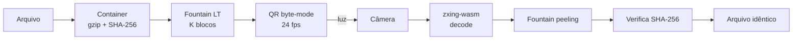

# Farol

Transferência de arquivos por **luz**: um dispositivo exibe o arquivo como um fluxo
de QR codes animados na tela; outro aponta a câmera e reconstrói o arquivo
bit-a-bit. Sem Wi-Fi, Bluetooth, cabo ou servidor — o dado viaja como imagem.

> POC de TCC sobre **Comunicação Tela-Câmera** (*Screen-Camera Communication*).
> Inspirado no [decimen](https://github.com/Pendia/Decimen-Optical-QR-Transfer)
> (QR animado + fountain) e no [libcimbar](https://github.com/sz3/libcimbar)
> (barcodes de cor, o estado da arte em densidade).

## Como funciona

Um enlace tela→câmera **não tem canal de retorno**: o receptor não pede
retransmissão e vai perder frames (blur, foco, timing de refresh). Por isso o
emissor transmite um fluxo **rateless** (código fountain LT): cada QR carrega o
XOR de um subconjunto pseudoaleatório dos blocos-fonte, e o receptor reconstrói o
arquivo a partir de **quaisquer ~K·1.15 frames distintos**, em qualquer ordem.
Frames perdidos custam tempo, nunca correção.



## Arquitetura (4 camadas ortogonais)

| Camada | Responsabilidade | Onde |
|---|---|---|
| Container | nome/tipo do arquivo, gzip quando ajuda, SHA-256 | [container.ts](app/shared/container.ts) |
| Fountain (rateless) | apagadura: reconstrói de qualquer ~K·1.15 frames | [fountain.ts](app/shared/fountain.ts) |
| PatternCodec | modulação visual plugável (QR hoje; cor/densa planejadas) | [pattern-codec.ts](app/shared/pattern-codec.ts) |
| Cripto (AEAD) | confidencialidade por palavra-chave | _(planejado — [ADR 0004](docs/decisions/0004-security-passphrase-aead.md))_ |

- **Emissor** ([send/main.ts](app/send/main.ts)): arquivo → container → fountain → QR animado.
- **Receptor** ([receive/main.ts](app/receive/main.ts)): câmera → **zxing-wasm** → fountain → download.
- **Decoder**: o app usa **zxing-wasm** (rápido/robusto, offline); o `jsQR` fica como
  decoder de referência dos testes (ver [ADR 0005](docs/decisions/0005-zxing-wasm-decoder.md)).

---

## Rodar na máquina (PC = transmissor)

Pré-requisitos: **Node 22+** e npm.

```powershell
npm install
npm run dev
```

Abra **http://localhost:5173/send/** no PC. Escolha um arquivo, clique em
**Transmitir** e depois em **⛶ Tela cheia** (QR grande = a câmera foca melhor).

> O PC é o transmissor ideal (tela grande e estável); o receptor é o celular.

## Rodar no celular (celular = receptor)

A câmera (`getUserMedia`) **só funciona em HTTPS** fora de `localhost`. Um IP de
LAN em HTTP (`http://192.168.x.x:5173`) **não** abre a câmera. Use um túnel HTTPS:

### Opção A — túnel Cloudflare (rápido, sem login)

```powershell
winget install --id Cloudflare.cloudflared     # só na primeira vez
cloudflared tunnel --url http://localhost:5173
```

Copie o endereço gerado (`https://<algo>.trycloudflare.com`) e, no celular, abra
`https://<algo>.trycloudflare.com/receive/`.

### Opção B — VS Code Port Forwarding

Painel **Ports** → **Forward a Port** → `5173` → botão direito → **Port
Visibility: Public**. Use o endereço `https://…devtunnels.ms/receive/` no celular.

> `allowedHosts: true` em [vite.config.ts](vite.config.ts) já aceita os hosts do
> túnel. O arquivo **não** passa pelo túnel — ele só entrega a página ao celular;
> a transferência acontece pela **luz** (tela → câmera).

### Testar a transferência

1. **Celular** → abra `.../receive/` → **Iniciar câmera** (a melhor lente traseira
   é escolhida automaticamente) → aponte para a tela do PC a **~25–30 cm**.
2. **PC** → `/send/` → escolha o arquivo → **Transmitir** → **⛶ Tela cheia**.
3. O celular mostra telemetria ao vivo (`câmera fps → leitura fps • KB/s • ETA`).
   Ao chegar a 100%: **"SHA-256 OK"** e o botão de download.

---

## Ajuste fino (painel do `/send/`)

Valores padrão seguem o decimen; ajuste conforme sua câmera/tela.

| Controle | Padrão | Efeito |
|---|---|---|
| **fps** | 24 | Cada QR deve ficar visível por ≥2 refreshes da tela. |
| **densidade** | 1465 B (QR v27) | Mais bytes/frame = mais rápido, se a câmera ainda decodificar. |
| **ECC** | L | O fountain cobre frames perdidos; o ECC do QR cobre corrupção interna. |

**Se travar em 0% ou baixa %** (frames borrados): use **Tela cheia**, **afaste**
o celular, aumente o **brilho** da tela, mantenha o aparelho **estável** e, se
preciso, **baixe a densidade** (858 B ou 520 B). É o trade-off velocidade × nitidez.

## Scripts

```powershell
npm run dev        # servidor de desenvolvimento (Vite, porta 5173)
npm run build      # build de produção → dist/
npm run preview    # serve o build de produção
npm test           # vitest (22 testes: golden vectors, fountain, sessão, e2e QR)
npm run typecheck  # tsc --noEmit
```

## Documentação

- Protocolo de fio: [docs/protocol.md](docs/protocol.md)
- Decisões de arquitetura: [docs/decisions/](docs/decisions/)
- Diário de aprendizado: [docs/DEVLOG.md](docs/DEVLOG.md)
- Roadmap (próximos passos): [docs/ROADMAP.md](docs/ROADMAP.md)

## Referências

- [decimen](https://github.com/Pendia/Decimen-Optical-QR-Transfer) — QR animado +
  fountain (mesma arquitetura; 418 KB/s medidos desktop→phone).
- [libcimbar](https://github.com/sz3/libcimbar) — barcodes de cor, ~106 KB/s
  (estado da arte; direção do futuro `PatternCodec` de cor).
- [divan/txqr](https://github.com/divan/txqr) — QR animado + fountain em Go, com
  ótimos artigos sobre por que fountain vence o loop sequencial.
